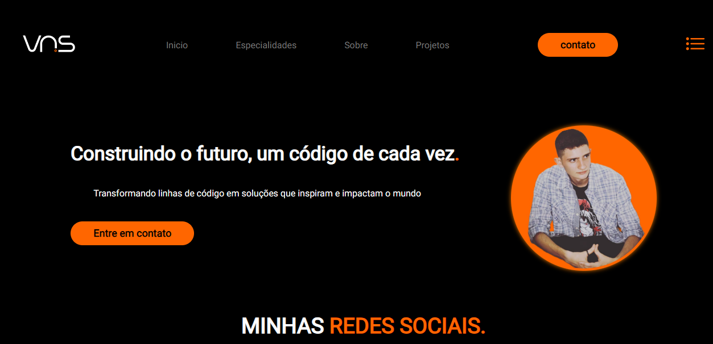
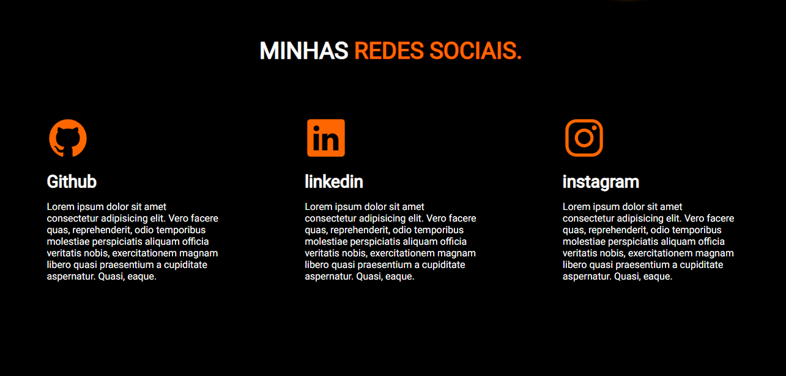
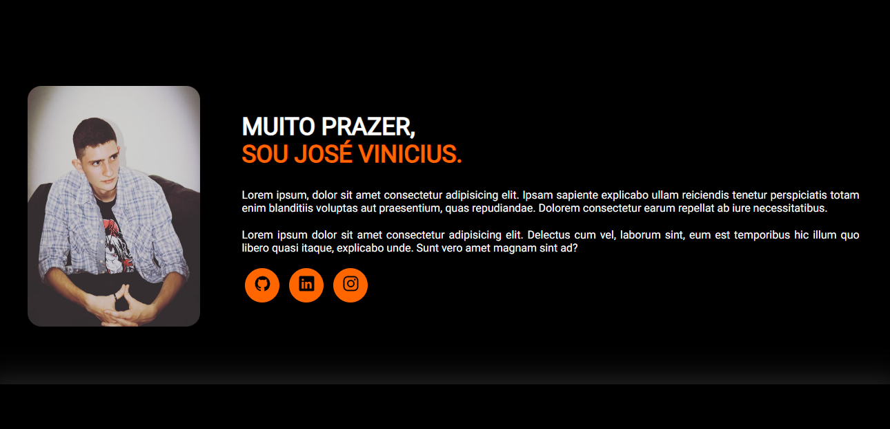
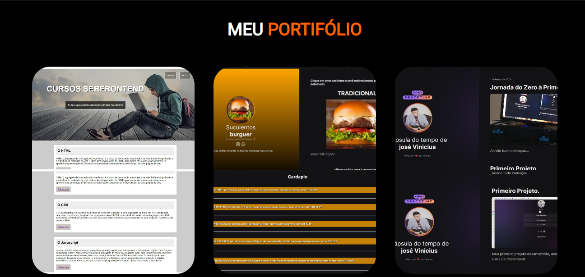
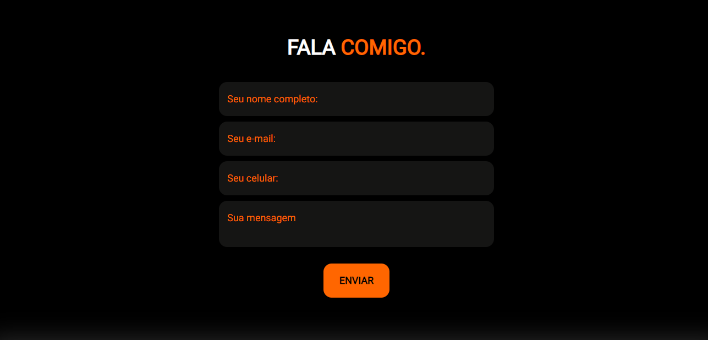

## 🖥️ Projeto
Esse é um projeto responsivo de um portifólio pessoal.
## 🛸 Tecnologia
Projeto desenvolvido por mim para a apresentação de meus serviços.:
- HTML
- CSS
- JavaScript 
- Git e Github

